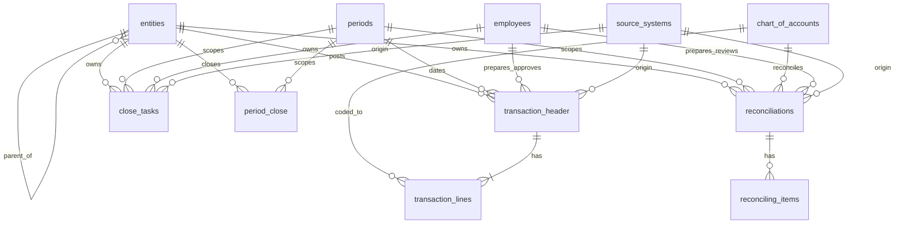

# Data model — Finance Close Intelligence Platform

> Resolves map ticket [#3 "Design the core relational data model"](https://github.com/spmcgraw/Portfolio/issues/3),
> part of the [Finance Close Intelligence spec map (#1)](https://github.com/spmcgraw/Portfolio/issues/1).
> Grounded in the [reference-close-models research (#4)](research/reference-close-models.md).
> This is the **spec** — `schema.sql` is written directly from it in the downstream build phase.

## What this layer is

This is the **gold layer** of a medallion architecture (bronze = raw source loads,
silver = cleaned/conformed, **gold = business-ready marts**). Bronze/silver concerns —
raw ingestion, per-system user tables, source-key lineage — sit **upstream** and are
out of scope here. Gold exposes conformed, consumption-ready tables that Power BI can
sit directly on top of.

The whole reason the platform exists is to **unify close data that today lives in two
disconnected tools** — the ERP (NetSuite) and the close-management tool (FloQast) —
into one model where cross-system questions ("who prepared JEs *and* owns overdue
recons") are answerable without a query-time join across systems.

## Design decisions and rationale

These are the decisions that shaped the model, with the "why" that makes them
defensible in an interview.

| Decision | Choice | Why |
|---|---|---|
| **Schema style** | **Fact constellation** (galaxy) — multiple fact tables sharing conformed dimensions | Gold layer feeds BI; dimensional beats 3NF for a consumption layer. More than one fact family (transactions, reconciliations, tasks, closes) → constellation, not a single star. |
| **JE grain** | JE modeled as **`transaction_header` + `transaction_lines`** (one row per distribution line) | Double-entry can't live in a single-amount row. Line grain makes the unbalanced-entry check and manual-JE ratio trivial, and mirrors the NetSuite export / Fivetran `dbt_netsuite` shape. |
| **Header vs line** | Split into two tables, not one flat table with a "line 0" header | A line-0 header row mixes two grains in one table and forces every query to self-join. Header/line is the clean multi-grain fact pattern (like `orders`/`order_lines`). |
| **Reconciliations** | First-class **`reconciliations` + `reconciling_items`** (same header/line pattern) | Recon completion % reads off the header; aged open items *need* item-level amount + open-date. A flag or column can't express either. |
| **Data-quality exceptions** | **Derived in views**, never stored as flags on rows | An unbalanced/uncoded/out-of-period entry is a *condition detectable* from base data, not a *fact to store*. Stored flags go stale the moment a line is edited. Views are never stale and demonstrate the derived-vs-source distinction. |
| **DQ triage/disposition** | **Deferred** to the governance-model decision | The human decision ("reviewed / accepted / resolved") is the one piece *not* derivable from base data — but it belongs with governance, not here. |
| **People / ownership** | One **conformed `employees` dimension** keyed on `employee_id`, FK'd from all five people-slots | Preparer / approver / task owner / recon preparer / recon reviewer are the same real-world identity. Conforming once at gold makes segregation-of-duties (compare ids, not spellings) and per-person workload trustworthy. NetSuite + FloQast both carry the employee id — that's the conforming key. |
| **Source system** | Small conformed **`source_systems` dimension**, FK'd from the activity tables | Origin is a property of the *event* (entry, task, recon), not of the account it hits. A dimension lets you slice volume/load by system and reinforces the "unify NetSuite + FloQast" story. |
| **Manual workarounds** | An **`entry_type` attribute** on `transaction_header` (manual / automated / recurring), not a table | "Manual" is a characteristic of entries you *measure* (manual-JE ratio), not an entity. Seed a bad month to make the metric land. |
| **Subledger / inventory adjustments** | Folded into `transactions` via `transaction_type`; the subledger→GL tie-out is a `reconciliations` row | Subledgers roll up to the GL — every adjustment posts as a JE. More accounting-accurate than a bespoke table, and leaner. |
| **Keys** | **Surrogate integer `_id` PKs everywhere**; business/human keys ride along as `_number`/`_code` attributes | Mirrors NetSuite's numerical "internal id"; line tables get their own surrogate (no composite key). Facts carry surrogate FKs. |
| **Dimension hierarchies** | **Flat** — `account_type` as a column, `parent_entity_id` as a self-FK (no snowflaking) | For a static synthetic dataset the snowflake normalization buys nothing and costs a join per query; Power BI is happiest with flat dims. |

**Naming convention:** surrogate PK = `<entity>_id` (integer identity); human-facing codes
= `<x>_number` / `<x>_code`; FKs reuse the referenced PK name.

## ERD

## Conformed dimensions (flat)

### `entities`
One row per legal entity. Consolidation hierarchy via self-reference.

| Column | Type | Notes |
|---|---|---|
| `entity_id` | int PK | surrogate |
| `entity_code` | text | business key (unique) |
| `entity_name` | text | |
| `parent_entity_id` | int FK → `entities.entity_id` | nullable; consolidation parent |
| `currency_code` | text | reporting currency |
| `is_active` | bool | |

### `chart_of_accounts`
One row per GL account. `account_type` is load-bearing (DQ rules + statement views).

| Column | Type | Notes |
|---|---|---|
| `account_id` | int PK | surrogate |
| `account_number` | text | business key (unique) |
| `account_name` | text | |
| `account_type` | text/enum | Asset / Liability / Equity / Revenue / Expense |
| `statement_section` | text | nullable; e.g. Current Assets |
| `is_active` | bool | |

### `periods`
One row per fiscal period. `end_date` drives days-to-close.

| Column | Type | Notes |
|---|---|---|
| `period_id` | int PK | surrogate |
| `period_code` | text | e.g. `2025-01` (unique) |
| `fiscal_year` | int | |
| `fiscal_period_no` | int | 1–12 |
| `start_date` | date | |
| `end_date` | date | period-end |

### `employees`
One row per person, conformed across NetSuite + FloQast on the employee id.

| Column | Type | Notes |
|---|---|---|
| `employee_id` | int PK | surrogate (= conforming employee id) |
| `employee_number` | text | business key (unique) |
| `employee_name` | text | |
| `role` | text/enum | Staff Accountant / Controller / FP&A / IT |
| `is_active` | bool | |

### `source_systems`
One row per originating application.

| Column | Type | Notes |
|---|---|---|
| `source_system_id` | int PK | surrogate |
| `source_system_name` | text | NetSuite / FloQast / Concur … |
| `category` | text | ERP / Close tool / Expense / Bank … |

## Facts and activity tables

### `transaction_header` — one row per journal entry

| Column | Type | Notes |
|---|---|---|
| `transaction_id` | int PK | surrogate ("internal id") |
| `document_number` | text | human-facing JE number |
| `transaction_type` | text/enum | Journal / Inventory Adjustment / Bill / … (also carries subledger adjustments) |
| `transaction_date` | date | |
| `entry_type` | text/enum | **manual / automated / recurring** (manual-JE ratio) |
| `entity_id` | int FK → `entities` | |
| `period_id` | int FK → `periods` | |
| `source_system_id` | int FK → `source_systems` | |
| `preparer_id` | int FK → `employees` | nullable |
| `approver_id` | int FK → `employees` | nullable |
| `memo` | text | nullable (missing-memo DQ rule) |

### `transaction_lines` — one row per distribution line

| Column | Type | Notes |
|---|---|---|
| `transaction_line_id` | int PK | surrogate |
| `transaction_id` | int FK → `transaction_header` | |
| `line_no` | int | ordering within the entry |
| `account_id` | int FK → `chart_of_accounts` | nullable/invalid → uncoded DQ rule |
| `debit` | numeric | |
| `credit` | numeric | |
| `memo` | text | nullable |

*Balance rule:* `SUM(debit) = SUM(credit)` per `transaction_id`. A computed signed
amount (`debit - credit`) can be exposed in a view if convenient.

### `reconciliations` — one row per entity × account × period

| Column | Type | Notes |
|---|---|---|
| `reconciliation_id` | int PK | surrogate |
| `entity_id` | int FK → `entities` | |
| `account_id` | int FK → `chart_of_accounts` | |
| `period_id` | int FK → `periods` | |
| `source_system_id` | int FK → `source_systems` | |
| `preparer_id` | int FK → `employees` | nullable |
| `reviewer_id` | int FK → `employees` | nullable |
| `status` | text/enum | Not started / In progress / Complete / Late |
| `due_date` | date | |
| `completed_date` | date | nullable |
| `gl_balance` | numeric | |
| `source_balance` | numeric | subledger/supporting balance |

### `reconciling_items` — one row per open item

| Column | Type | Notes |
|---|---|---|
| `reconciling_item_id` | int PK | surrogate |
| `reconciliation_id` | int FK → `reconciliations` | |
| `item_no` | int | |
| `description` | text | |
| `amount` | numeric | |
| `open_date` | date | drives aging buckets |
| `status` | text/enum | Open / Resolved |

### `close_tasks` — one row per checklist task (entity × period)

| Column | Type | Notes |
|---|---|---|
| `close_task_id` | int PK | surrogate |
| `entity_id` | int FK → `entities` | |
| `period_id` | int FK → `periods` | |
| `owner_id` | int FK → `employees` | **nullable → ownership-gap seed** |
| `source_system_id` | int FK → `source_systems` | |
| `task_name` | text | |
| `due_date` | date | |
| `completed_date` | date | nullable |
| `status` | text/enum | Not started / In progress / Complete / Overdue |

*Siblings with `reconciliations`, not parent/child — in FloQast, tasks and recons are
separate tabs. Optional `close_task_id` link on `reconciliations` deliberately skipped.*

### `period_close` — one row per entity × period (the close itself)

| Column | Type | Notes |
|---|---|---|
| `period_close_id` | int PK | surrogate |
| `entity_id` | int FK → `entities` | |
| `period_id` | int FK → `periods` | |
| `close_start_date` | date | |
| `close_complete_date` | date | nullable while open |
| `target_close_date` | date | enables target-vs-actual |
| `status` | text/enum | Open / Closed |

*Carries the flagship **days-to-close** metric = `close_complete_date − periods.end_date`,
kept explicit (not derived from task completeness) so it supports a target and a trend.*

## Analytical layer (views, not tables)

Detail is ticket #6 (view catalog); fixed here only that DQ exceptions are **derived**.

| View | Reads from | Surfaces |
|---|---|---|
| `v_close_health` | `period_close`, `close_tasks`, `reconciliations` | days-to-close, task completion, overdue/unassigned |
| `v_reconciliations` | `reconciliations`, `reconciling_items` | completion %, aged open items (0–30/31–60/60+) |
| `v_journal_activity` | `transaction_header/_lines` | JE volume, manual-JE ratio, reversal rate |
| `v_ownership_gaps` | `close_tasks`, `transaction_header` | null owners, preparer = approver |
| `v_dq_exceptions` | base tables | unbalanced, uncoded, out-of-period, duplicate, missing-memo |

## Deferred / out of scope for this model

- **DQ triage/disposition table** → decided with the governance model.
- **Native source-system user ids** as provenance → dropped (silver concern).
- **`close_task_id` link** on `reconciliations` → skipped (separate FloQast tabs).
- Everything in the map's build phase (actual `schema.sql`, load scripts, Power BI).
